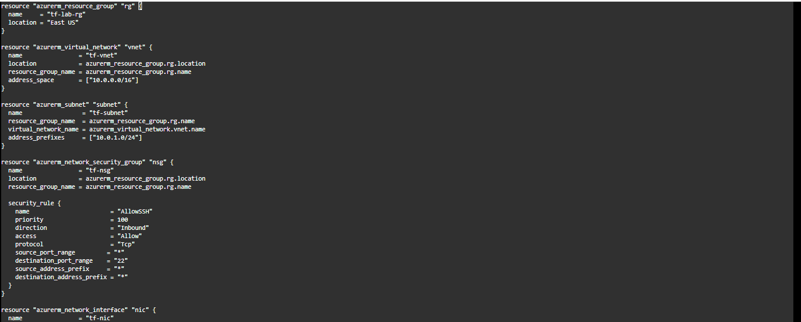
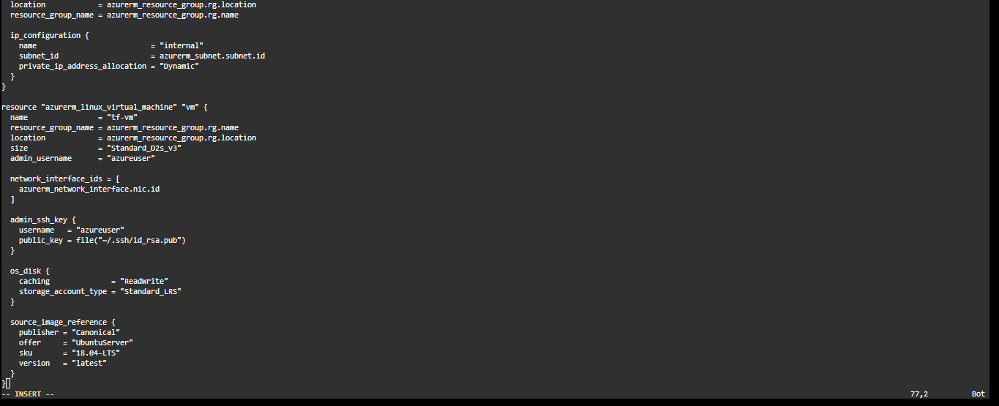

## Project Title

Implementing Shift-left Security for Azure Infrastructure Deployment using Terraform and Checkov

## Objective

The aim of this project is to demonstrate a shift-left security approach to the deployment of Azure infrastructure by integrating security scanning into the infrastructure as code (Iac) development lifecycle. Using Checkov, the project performs static analysis of Terraform configutations to identify and remediate security misconfigurations before deployment, thereby reducing risk and improving infrastructure security. 

Additionally, the project showcases the use of security capabilities within the microsoft security stack to implement secure access controls for deployed Azure resources, promoting adherence to cloud security best practices and enhancing the overall security posture of the environment.

## Tools Used

Terraform, Checkov, Azure Cloudshell, Azure Key Vault, Azure Bastion

## Lab Setup

* Creation of a new directory for Terraform and configuration of its files via cloudshell
* Deployment of Azure infrastructure with Terraform
* Configuration of security add-ons
* Implementation of security scanning and remediation

## Background Information

The project is designed to demonstrate the application of the shift-left security principle in support of both infrastructure engineering and DevOps practices. As IaC has become a fundamental component of modern infrastructure provisioning and software delivey, ensuring the security of IaC configuration is essential.

Given the complexity and scale of IaC deployments, manual code reviews may fail to identify critical security misconfiguration and vulnerabilities. To address this challenge, the project integrates automated security scanning into the development workflow, enabling potential risks to be detected and  and remediated before deployment. By identifying security issues early in the development lifecycle, this aproach enhances the security, reliability, and compliance of Azure infrastructure deployments while reducing the likelihood of costly post-deployment remediation.

Consequently, this project focuses on deploying Azure Infrastructure including a virtual machine with virtual network, network security group, resource group and a subnet using Terraform and integrating security scanning of IaC to identify and eliminate misconfigurations before deployment. The primary workload deployed in this project is a Linux virtual machine (VM) which is configured to use SSH key-based authentication. During provisioning, Terraform uploads the SSH public key to Azure and configures iton the VM, while the corresponding private key is retained securely for authentication. This approach enhances security by reducing the risk associated with password-based authentication, aligning with cloud security best practices. The SSH key pair is generated as shown in following figure.

Finally, Azure Bastion will be deployed to provide secure browser-based connectivity to the Linux VM without exposing it directly to the internet. Initially, the SSH private key will be imported as a file from the local computer to authennticate remote access. To further strengthen security and improve key management, the private key is subsequently stored securely as a secret in Azure Key Vault and retrieved when needed, eliminating the need to rely on locally stored credentials. Lastly, Checkov will be integrated into the workflow to perform security scanning of the Terraform IaC, enabling security misconfigurations and policy violations to be identified and remediated prior to deployment, reinforcing a shift-left security approach and promoting more secure and compliant infrastructure provisioning.

## Steps Taken

The project was accomplished in the following order.

### Creation of a new directory for Terraform and configuration of its files via cloudshell

Azure Cloudshell was launched from Azure Portal, and a storage was specified to store created files. The integration of a storage account is optional,  but it stores the files and makes them available when the cloudshell session is restarted. In the cloudshell session a new directory 'Terraform-lab' was created and Terraform was initialized in the directory with 'Terraform init' command, followed with the configuration of the files. The files with a .tf extension contain declarative infrastructure configurations written in the HashiCorp Configuration Language (HCL). They define what infrastructure components (like virtual machines, networks, and databases) should exist and how they should be configured.

Below is a snippet of the file (main.tf) defining the infrastructure.

### Deployment of Azure infrastructure with Terraform

After the neccessary files are in place, the command 'terraform plan' was used to generate a preview of changes Terraform intends to make. 

Afterwards, 'terraform apply' command is used to apply the changes generated from the last command basically creating the infrastructure.  

Checking through the Azure portal, it was confirmed that the infrastructure were successfully deployed ranging from the resource group to the virtual machine. 

### Configuration of security add-ons

Azure Bastion was deployed to enable secured access to the virtual machine.

Recall that the SSH public key has already been integrated in the VM by Azure. Here, the SSH private key available on the local computer is specified to complete the authentication. 

Confirming the succesful authentication against the Linux VM.

Instead of relying on the manual upload of the SSH private key during authentication, a practice that can increase the risk of credential exposure. This project leverages Azure Key Vault for secure key management. The SSH private key is stored as a secret within Azure Key Vault, enabling centralized protection, controlled access, and more secure authentication workflows while reducing dependence on locally stored sensitive credentials.

To create a secret in the newly created key vault, the user was assigned the appropriate role-based access control (RBAC) role.

Afterwards, the secret was created, via Azure Cloudshell.

The creation of the secret was confirmed from Azure portal.

Subsequent logon to the Linux VM now utilize the secret in the key vault, thereby strengthening the security of the deployed VM.

Confirmed the successful logon to the Linux VM.

### Implementation of security scanning and remediation

Checkov is the third-party tool used for the security scanning of the IaC. The process begin with the installation of Chekov. The installation was confirmed by checking the version installed.

While in the 'Terraform-lab' directory, the command 'Checkov -d .' was ran to scan the IaC. However, running the command outside the directory will require specifying the path to the IaC. From the scanning result, it was revealed that we have three failed checks to remediate.

The result is mainly grouped into two categories, passed checks and failed checks. 
The passed checks indicate that the configurations are accurate and safe,

while the failed checks indicate one or more misconfiguration(s) in the IaC.

Remediating the first miconfiguration, 'ensure that SSH access is restricted from the internet,' the source address prefix is restricted to the AzureBastionSubnet. This ensures that only connections established from the subnet could access the VM remotely via SSH.

The next misconfiguration 'ensure VNET subnet is configured with a network security group (NSG)' was remediated by assosciating the subnet to a NSG. This allows the assocuaition of relevant NSG security rule to the subnet, thereby enhancing the security of the subnet.

The last misconfiguration 'ensure virtual machine extensions are not installed' was investigted. It was observed that the VM has no extension, hence the error was skipped.

Having remediated all the misconfigurations, the IaC was re-scanned, and no failed checks were reported.

## Conclusion
This project succesfully demonstrate the application of a shift-left security approach to infrastructure provisioning by integrating security practices early in the IaC development lifecycle.  Furthermore, the project showcases key competencies relevant to DevSecOps and cloud security engineering, including secure infastructure provisioning, IaC security scanning, secrets management, role-based access control, and secure remote access. These capabilities reflect the collaborative role that security engineers play alongside DevOps team in building and maintaining resilient, secure and compliant cloud environments.  

## Past Project

* Deployment of Azure Firewall for secure access and traffic control https://rhosinjay-cyb.github.io/Azure-Firewall/
* Deployment of Microsoft Sentinel to support cloud workload protection https://rhosinjay-cyb.github.io/Microsoft-Sentinel/
* Automating Security Incident Response with Playbooks https://rhosinjay-cyb.github.io/Incident-Response-with-Playbooks/
